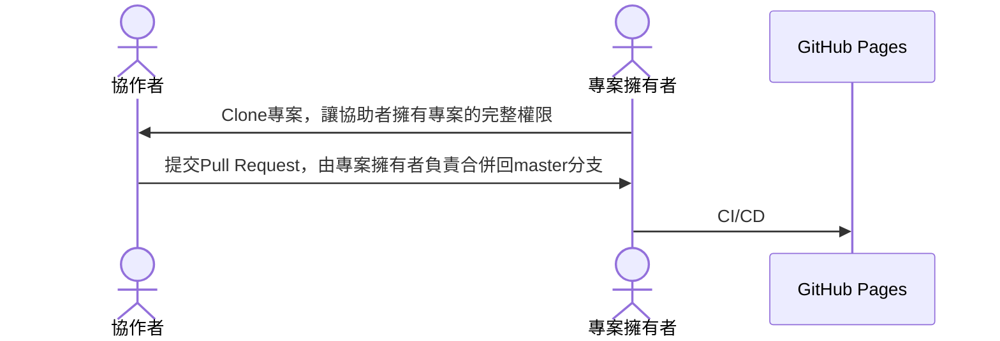

## PREPARE

### [Docusaurus](https://docusaurus.io/)
- Build optimized websites quickly, focus on your content

### [Mermaid](https://mermaid.js.org/)
- JavaScript based diagramming and charting tool that renders Markdown-inspired text definitions to create and modify diagrams dynamically.

### [Node.js](https://nodejs.org/zh-tw/download)
- 安裝最新版: 18.15.0 (包含 npm 9.5.0)

### [Visual Studio Code](https://code.visualstudio.com/Download)
- 安裝最新版：1.77.1
- 擴充套件
1. Markdown Preview Enhanced
2. GitHub Pull Requests and Issues
3. Prettier
4. sql-formatter-plus npm

### [Git](https://git-scm.com/downloads)
- 安裝最新版：2.40.0

### [GitHub](https://github.com/)
- Github是以Git為核心的線上協作平台

### [連猴子都能懂的Git入門指南](https://backlog.com/git-tutorial/tw/intro/intro1_1.html)
- 版本控制概念

## 協作方式-GitHub
- 以Pull Request為中心的合作流程方式，透過fork專案做出貢獻~
- [GitHub - 參與一個專案](https://git-scm.com/book/zh-tw/v2/GitHub-%E5%8F%83%E8%88%87%E4%B8%80%E5%80%8B%E5%B0%88%E6%A1%88)

