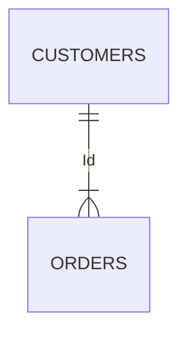

# 基本屬性

### 性別
```jsx title="男性/女性(※ 此處可以多撰寫一些業務邏輯定義)"
SELECT customers.Name, orders.Order_No
FROM customers
INNER JOIN orders
ON customers.C_Id=orders.C_Id;
```


### 年齡
### 行業類別
### 顧客開戶、異動留存行業類別
### 公司職稱
### 學歷
### 婚姻狀況
### 子女數
### 國別
### 主往來分行代碼
### 理專註記
### 理財會員
### AUM月底餘額
### AUM_台幣活存月平均餘額
### AUM_台幣定存月平均餘額
### AUM_外幣活存月平均餘額
### AUM_外幣定存月平均餘額
### AUM_理財(月底餘額)
### AUM_理財(月底現值)
### 風險承受等級評估KYC
### 風險承受等級評估KYC(到期日)
### 個網銀狀態
### 個網銀實動戶註記(近90天有登入)
### 行銀實動戶註記(近90天有登入)
### 純卡友
### 純存戶
### 薪轉戶
### 頂級卡
### 醫師
### 律師
### 會計師
### 建築師
### 工程師
### 月收入推估
### (薪轉->繳稅推估)
### wallet share(%)


```bash
## ABC

## CBA
```

