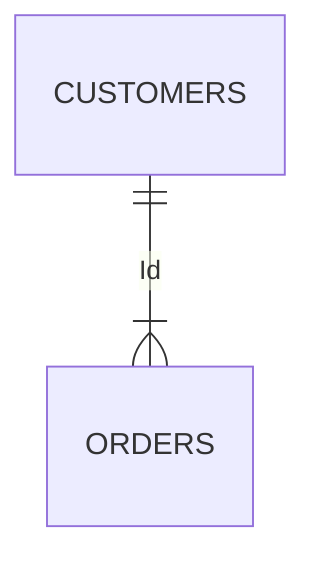

# 基本屬性

### 性別

```jsx title="男性/女性(※ 此處可以多撰寫一些業務邏輯定義)" showLineNumbers
SELECT customers.Name, orders.Order_No
FROM customers
INNER JOIN orders
ON customers.C_Id=orders.C_Id;
```



### 年齡
```jsx title="年齡" showLineNumbers
WITH sampleCTE (id, name, phoneNumber, age)
AS
-- 定義 CTE 的 Query
(
    SELECT
			id,
			name,
			phoneNumber,
			date_part('year', NOW()) - date_part('year', dob) AS age
    FROM member
    WHERE phoneNumber IS NOT NULL
-- 使用 CTE
SELECT *
FROM sampleCTE
WHERE age >= 18
```

### 行業類別

### 顧客開戶、異動留存行業類別

### 公司職稱

### 學歷

### 婚姻狀況

### 子女數

### 國別

### 主往來分行代碼

### 理專註記

### 理財會員

### AUM 月底餘額

### AUM_台幣活存月平均餘額

### AUM_台幣定存月平均餘額

### AUM_外幣活存月平均餘額
### AUM_外幣定存月平均餘額
### AUM_理財(月底餘額)
### AUM_理財(月底現值)

### 風險承受等級評估 KYC

### 風險承受等級評估 KYC(到期日)

### 個網銀狀態

### 個網銀實動戶註記(近 90 天有登入)

### 行銀實動戶註記(近 90 天有登入)

### 純卡友

### 純存戶

### 薪轉戶

### 頂級卡

### 醫師

### 律師

### 會計師

### 建築師

### 工程師

### 月收入推估

### (薪轉->繳稅推估)

### wallet share(%)
