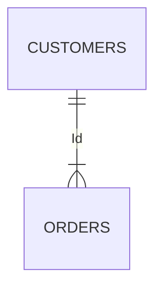

# 基本屬性

| 業務代碼  | 欄位名稱                      | 欄位說明              | MView / View |  備註 |
|-------|---------------------------|-------------------|--------------|-----|
| BASIC | BASIC_GENDER              | 性別                |              |     |
| BASIC | BASIC_AGE                 | 年齡                |              |     |
| BASIC | BASIC_INDUSTRY            | 行業類別              |              |     |
| BASIC | BASIC_TITLE               | 公司職稱              |              |     |
| BASIC | BASIC_EDUCATION           | 學歷                |              |     |
| BASIC | BASIC_MARRIAGE            | 婚姻狀況              |              |     |
| BASIC | BASIC_CHILDREN            | 子女數               |              |     |
| BASIC | BASIC_COUNTRY_CODE        | 國別代碼              |              |     |
| BASIC | BASIC_MAINBRANCH_CODE     | 主往來分行代碼           |              |     |
| BASIC | BASIC_FC_IND              | 理專註記              |              |     |
| BASIC | BASIC_WEALTHMEMBER        | 理財會員              |              |     |
| BASIC | BASIC_AUM                 | AUM月底餘額           |              |     |
| BASIC | BASIC_MD_AUM              | AUM_台幣活存前30天平均餘額  |              |     |
| BASIC | BASIC_FD_AUM              | AUM_台幣定存前30天平均餘額  |              |     |
| BASIC | BASIC_MY_AUM              | AUM_外幣活存前30天平均餘額  |              |     |
| BASIC | BASIC_FY_AUM              | AUM_外幣定存前30天平均餘額  |              |     |
| BASIC | BASIC_WEALTH_AUM          | AUM_理財 (月底餘額)     |              |     |
| BASIC | BASIC_WEALTHPV_AUM        | AUM_理財(月底現值)      |              |     |
| BASIC | BASIC_CUSTRISK            | 風險承受等級評估KYC)      |              |     |
| BASIC | BASIC_CUSTRISKEND_DT      | 風險承受等級評估KYC)到期日   |              |     |
| BASIC | BASIC_WEBSTATUS           | 個網銀狀態             |              |     |
| BASIC | BASIC_WEBLOGIN90D         | 個網銀實動戶註記(近90天有登入) |              |     |
| BASIC | BASIC_APPLOGIN90D         | 行銀實動戶註記(近90天有登入)  |              |     |
| BASIC | BASIC_PURECC_IND          | 純卡友               |              |     |
| BASIC | BASIC_PUREDP_IND          | 純存戶               |              |     |
| BASIC | BASIC_PAYROLL_IND         | 薪轉戶               |              |     |
| BASIC | BASIC_TOPCC_IND           | 頂級卡               |              |     |
| BASIC | BASIC_DOCTOR_IND          | 醫師                |              |     |
| BASIC | BASIC_LAWYER_IND          | 律師                |              |     |
| BASIC | BASIC_ACCOUNTANT_IND      | 會計師               |              |     |
| BASIC | BASIC_ARCHITECT_IND       | 建築師               |              |     |
| BASIC | BASIC_ENGINNER_IND        | 工程師               |              |     |
| BASIC | BASIC_SALARY_PROXY_INCOME | 月收入推估             |              |     |
| BASIC | BASIC_WALLET_SHARE        | wallet share(%)   |              |     |


### 性別、年齡、行業類別

```sql title="此處可以撰寫一些業務邏輯定義" showLineNumbers
SELECT customers.Name, orders.Order_No
FROM customers
INNER JOIN orders
ON customers.C_Id=orders.C_Id;
```



### 年齡
```sql title="定義" showLineNumbers
WITH sampleCTE (id, name, phoneNumber, age)
AS
-- 定義 CTE 的 Query
(
    SELECT
			id,
			name,
			phoneNumber,
			date_part('year', NOW()) - date_part('year', dob) AS age
    FROM member
    WHERE phoneNumber IS NOT NULL
-- 使用 CTE
SELECT *
FROM sampleCTE
WHERE age >= 18
```

### 行業類別

```sql title="年齡" showLineNumbers
SELECT
    count(*) AS 訂單數
FROM
    orders
WHERE
    customerID = (
        SELECT
            id
        FROM
            Customers
        WHERE
            name = 'apple'
    )
```

### 顧客開戶、異動留存行業類別

### 公司職稱

### 學歷

### 婚姻狀況

### 子女數

### 國別

### 主往來分行代碼

### 理專註記

### 理財會員

### AUM 月底餘額

### AUM_台幣活存月平均餘額

### AUM_台幣定存月平均餘額

### AUM_外幣活存月平均餘額、AUM_外幣定存月平均餘額
``` sql title="外幣活定存月平均餘額" showLineNumbers
/*
- 表格名稱：基本屬性標籤 [BASIC_TABLE_FSACC]
- MAIN TABLE：ODS_D_FSBLD (外幣帳戶庫存檔), ODS_D_FSCST (外匯活存帳戶主檔) 
- PK：ACC_NO
- TEMP VIEW：ACC_NO(帳戶ID), CUR_CODE(幣別代碼), CSTFG(活定存判斷式), FS_AVG_AMT(外幣帳戶平均工作日)))
- MATERIALIZE VIEW: CUST_ID(客戶ID), CUR_CODE(幣別代碼), BASIC_FD_AUM(AUM_外幣定存前1個月平均餘額), BASIC_MY_AUM(AUM_外幣活存前1個月平均餘額))
*/
with A as 
(
    select
        FSBLD_ACC_ID_NO       as ACC_NO
        ,FSBLD_CURCD          as CUR_CODE
        ,date(FSBLD_YYMMDD)   as DATE_VAL
        ,trim(FSBLD_CSTFG)    as CSTFG
        ,FSBLD_AVBAL_INT      as FS_AVBAL_AMT
    from
        ODS_D_FSBLD
    where
        /*4週工作日的每一筆資料但實際資料會依照國定假日為主*/
        date(FSBLD_YYMMDD) >= date_add('month', -1 , current_date) 
)
/*計算總計幾個工作日*/
,B as
(
    select
        A.ACC_NO
        ,A.CUR_CODE
        ,A.CSTFG
        ,COUNT(A.ACC_NO) as DVD_NBR
    from
        A
    group by
        1, 2, 3
)
,C as
(
select
    AA.ACC_NO
    ,AA.CUR_CODE
    ,AA.CSTFG
    ,FS_TOTAL_AMT/ B.DVD_NBR as FS_AVG_AMT
from
    (
    select
        A.ACC_NO
        ,A.CUR_CODE
        ,A.CSTFG            /*0:活存 | 1:定存*/
        ,sum(A.FS_AVBAL_AMT) as FS_TOTAL_AMT /*依帳戶的加總值*/
    from
        A
    group by
        1, 2, 3
    ) AA
join
    B
on
    AA.ACC_NO = B.ACC_NO
    and
    AA.CUR_CODE = B.CUR_CODE
    and
    AA.CSTFG = B.CSTFG
)
select
    D.FSCST_ID_CODE as CUST_ID
    ,C.CUR_CODE
    ,coalesce(case when C.CSTFG = '0' then C.FS_AVG_AMT end, 0) as BASIC_FD_AUM
    ,coalesce(case when C.CSTFG = '1' then C.FS_AVG_AMT end, 0) as BASIC_FS_ACCAVG
from
    ODS_D_FSCST D
join
    C
on
    trim(D.FSCST_ACC_ID_NO) = trim(C.ACC_NO)
```
### AUM_理財(月底餘額)
### AUM_理財(月底現值)

### 風險承受等級評估 KYC

### 風險承受等級評估 KYC(到期日)

### 個網銀狀態

### 個網銀實動戶註記(近 90 天有登入)

### 行銀實動戶註記(近 90 天有登入)

### 純卡友

### 純存戶

### 薪轉戶

### 頂級卡

### 醫師

### 律師

### 會計師

### 建築師

### 工程師

### 月收入推估

### (薪轉->繳稅推估)

### wallet share(%)
