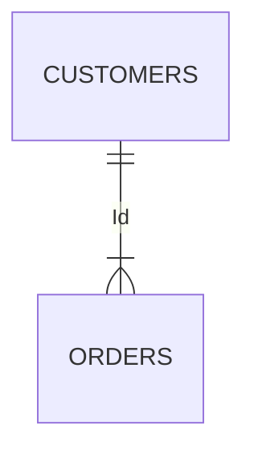

# 產品往來

| 業務代碼 | 欄位名稱                    | 欄位說明                                  | MView / View | 備註 |
|------|-------------------------|---------------------------------------|--------------|----|
| CC   | CC_RECACCTNO            | 最近一張往來信用卡(信用卡卡號)                      |              |    |
| CC   | CC_RECISSUE_DT          | 最近一張信用卡發卡日                            |              |    |
| CC   | CC_RECBUY_DT            | 最近一次信用卡消費日                            |              |    |
| CC   | CC_FIRSTBUY_DT          | 第一次信用卡消費日                             |              |    |
| CC   | CC_TXNREC1M_AMT         | 近一期本行簽帳金額                             |              |    |
| CC   | CC_TXNREC6M_AMT         | 近半年期本行簽帳金額                            |              |    |
| CC   | CC_TXNREC1Y_AMT         | 近一年期本行簽帳金額                            |              |    |
| CC   | CC_EAPPLY_IND           | 是否曾線上辦卡                               |              |    |
| CC   | CC_APPLY1M_IND          | 近一個月有辦卡                               |              |    |
| CC   | CC_EACCT_IND            | 信用卡帳單e化註記                             |              |    |
| CC   | CC_BILLAUTOACCT_IND     | 是否有辦信用卡帳單自動扣繳                         |              |    |
| CC   | CC_PERMLIMIT            | 本行信用卡額度_上月                            |              |    |
| CC   | CC_OUCARD_IND           | OU點點卡註記                               |              |    |
| CC   | CC_UNIVERSECARD_IND     | 寰宇現金回饋卡註記                             |              |    |
| DD   | DD_MD                   | 數位存款帳戶註記(台幣)                          |              |    |
| DD   | DD_MY                   | 數位存款帳戶註記(外幣)                          |              |    |
| FD   | FD_CPA                  | 最近一筆台幣定存金額                            |              |    |
| FD   | FD_START                | 最近一筆台幣定存起始日                           |              |    |
| FD   | FD_END                  | 最近一筆台幣定存到期日                           |              |    |
| FX   | FX_WEBTXN_BUYCNT        | 近一個月有網銀買外幣次數                          |              | [連結](#近一個月有網銀買外幣次數近一個月有買外幣金額近一個月有網銀賣外幣次數近一個月有網銀賣外幣金額近一個月有行銀買外幣金額近一個月有行銀買外幣金額近一個月有行賣外幣次數近一個月有行銀賣外幣金額近一個月有臨櫃買外幣次數近一個月有臨櫃買外幣金額近一個月有臨櫃賣外幣次數近一個月有臨櫃賣外幣金額近一個月有提領現鈔次數近一個月有提領現鈔金額近一個月有現鈔存入次數近一個月有現鈔存入金額)   |
| FX   | FX_WEBTXN_BUYTWDAMT     | 近一個月有買外幣金額                            |              | [連結](#近一個月有網銀買外幣次數近一個月有買外幣金額近一個月有網銀賣外幣次數近一個月有網銀賣外幣金額近一個月有行銀買外幣金額近一個月有行銀買外幣金額近一個月有行賣外幣次數近一個月有行銀賣外幣金額近一個月有臨櫃買外幣次數近一個月有臨櫃買外幣金額近一個月有臨櫃賣外幣次數近一個月有臨櫃賣外幣金額近一個月有提領現鈔次數近一個月有提領現鈔金額近一個月有現鈔存入次數近一個月有現鈔存入金額)  |
| FX   | FX_WEBTXN_SELLCNT       | 近一個月有網銀賣外幣次數                          |              | [連結](#近一個月有網銀買外幣次數近一個月有買外幣金額近一個月有網銀賣外幣次數近一個月有網銀賣外幣金額近一個月有行銀買外幣金額近一個月有行銀買外幣金額近一個月有行賣外幣次數近一個月有行銀賣外幣金額近一個月有臨櫃買外幣次數近一個月有臨櫃買外幣金額近一個月有臨櫃賣外幣次數近一個月有臨櫃賣外幣金額近一個月有提領現鈔次數近一個月有提領現鈔金額近一個月有現鈔存入次數近一個月有現鈔存入金額)   |
| FX   | FX_WEBTXN_SELLTWDAMT    | 近一個月有網銀賣外幣金額                          |              | [連結](#近一個月有網銀買外幣次數近一個月有買外幣金額近一個月有網銀賣外幣次數近一個月有網銀賣外幣金額近一個月有行銀買外幣金額近一個月有行銀買外幣金額近一個月有行賣外幣次數近一個月有行銀賣外幣金額近一個月有臨櫃買外幣次數近一個月有臨櫃買外幣金額近一個月有臨櫃賣外幣次數近一個月有臨櫃賣外幣金額近一個月有提領現鈔次數近一個月有提領現鈔金額近一個月有現鈔存入次數近一個月有現鈔存入金額)  |
| FX   | FX_APPTXN_BUYCNT        | 近一個月有行銀買外幣金額                          |              | [連結](#近一個月有網銀買外幣次數近一個月有買外幣金額近一個月有網銀賣外幣次數近一個月有網銀賣外幣金額近一個月有行銀買外幣金額近一個月有行銀買外幣金額近一個月有行賣外幣次數近一個月有行銀賣外幣金額近一個月有臨櫃買外幣次數近一個月有臨櫃買外幣金額近一個月有臨櫃賣外幣次數近一個月有臨櫃賣外幣金額近一個月有提領現鈔次數近一個月有提領現鈔金額近一個月有現鈔存入次數近一個月有現鈔存入金額)  |
| FX   | FX_APPTXN_BUYTWDAMT     | 近一個月有行銀買外幣金額                          |              | [連結](#近一個月有網銀買外幣次數近一個月有買外幣金額近一個月有網銀賣外幣次數近一個月有網銀賣外幣金額近一個月有行銀買外幣金額近一個月有行銀買外幣金額近一個月有行賣外幣次數近一個月有行銀賣外幣金額近一個月有臨櫃買外幣次數近一個月有臨櫃買外幣金額近一個月有臨櫃賣外幣次數近一個月有臨櫃賣外幣金額近一個月有提領現鈔次數近一個月有提領現鈔金額近一個月有現鈔存入次數近一個月有現鈔存入金額)  |
| FX   | FX_APPTXN_SELLCNT       | 近一個月有行銀賣外幣次數                          |              | [連結](#近一個月有網銀買外幣次數近一個月有買外幣金額近一個月有網銀賣外幣次數近一個月有網銀賣外幣金額近一個月有行銀買外幣金額近一個月有行銀買外幣金額近一個月有行賣外幣次數近一個月有行銀賣外幣金額近一個月有臨櫃買外幣次數近一個月有臨櫃買外幣金額近一個月有臨櫃賣外幣次數近一個月有臨櫃賣外幣金額近一個月有提領現鈔次數近一個月有提領現鈔金額近一個月有現鈔存入次數近一個月有現鈔存入金額)  |
| FX   | FX_APPTXN_SELLTWDAMT    | 近一個月有行銀賣外幣金額                          |              | [連結](#近一個月有網銀買外幣次數近一個月有買外幣金額近一個月有網銀賣外幣次數近一個月有網銀賣外幣金額近一個月有行銀買外幣金額近一個月有行銀買外幣金額近一個月有行賣外幣次數近一個月有行銀賣外幣金額近一個月有臨櫃買外幣次數近一個月有臨櫃買外幣金額近一個月有臨櫃賣外幣次數近一個月有臨櫃賣外幣金額近一個月有提領現鈔次數近一個月有提領現鈔金額近一個月有現鈔存入次數近一個月有現鈔存入金額)   |
| FX   | FX_BRANCHTXN_BUYCNT     | 近一個月有臨櫃買外幣次數                          |              | [連結](#近一個月有網銀買外幣次數近一個月有買外幣金額近一個月有網銀賣外幣次數近一個月有網銀賣外幣金額近一個月有行銀買外幣金額近一個月有行銀買外幣金額近一個月有行賣外幣次數近一個月有行銀賣外幣金額近一個月有臨櫃買外幣次數近一個月有臨櫃買外幣金額近一個月有臨櫃賣外幣次數近一個月有臨櫃賣外幣金額近一個月有提領現鈔次數近一個月有提領現鈔金額近一個月有現鈔存入次數近一個月有現鈔存入金額)  |
| FX   | FX_BRANCHTXN_BUYTWDAMT  | 近一個月有臨櫃買外幣金額                          |              | [連結](#近一個月有網銀買外幣次數近一個月有買外幣金額近一個月有網銀賣外幣次數近一個月有網銀賣外幣金額近一個月有行銀買外幣金額近一個月有行銀買外幣金額近一個月有行賣外幣次數近一個月有行銀賣外幣金額近一個月有臨櫃買外幣次數近一個月有臨櫃買外幣金額近一個月有臨櫃賣外幣次數近一個月有臨櫃賣外幣金額近一個月有提領現鈔次數近一個月有提領現鈔金額近一個月有現鈔存入次數近一個月有現鈔存入金額)   |
| FX   | FX_BRANCHTXN_SELLCNT    | 近一個月有臨櫃賣外幣次數                          |              | [連結](#近一個月有網銀買外幣次數近一個月有買外幣金額近一個月有網銀賣外幣次數近一個月有網銀賣外幣金額近一個月有行銀買外幣金額近一個月有行銀買外幣金額近一個月有行賣外幣次數近一個月有行銀賣外幣金額近一個月有臨櫃買外幣次數近一個月有臨櫃買外幣金額近一個月有臨櫃賣外幣次數近一個月有臨櫃賣外幣金額近一個月有提領現鈔次數近一個月有提領現鈔金額近一個月有現鈔存入次數近一個月有現鈔存入金額)   |
| FX   | FX_BRANCHTXN_SELLTWDAMT | 近一個月有臨櫃賣外幣金額                          |              | [連結](#近一個月有網銀買外幣次數近一個月有買外幣金額近一個月有網銀賣外幣次數近一個月有網銀賣外幣金額近一個月有行銀買外幣金額近一個月有行銀買外幣金額近一個月有行賣外幣次數近一個月有行銀賣外幣金額近一個月有臨櫃買外幣次數近一個月有臨櫃買外幣金額近一個月有臨櫃賣外幣次數近一個月有臨櫃賣外幣金額近一個月有提領現鈔次數近一個月有提領現鈔金額近一個月有現鈔存入次數近一個月有現鈔存入金額)   |
| FX   | FX_WITHDRAW_CNT         | 近一個月有提領現鈔次數                           |              | [連結](#近一個月有網銀買外幣次數近一個月有買外幣金額近一個月有網銀賣外幣次數近一個月有網銀賣外幣金額近一個月有行銀買外幣金額近一個月有行銀買外幣金額近一個月有行賣外幣次數近一個月有行銀賣外幣金額近一個月有臨櫃買外幣次數近一個月有臨櫃買外幣金額近一個月有臨櫃賣外幣次數近一個月有臨櫃賣外幣金額近一個月有提領現鈔次數近一個月有提領現鈔金額近一個月有現鈔存入次數近一個月有現鈔存入金額)  |
| FX   | FX_WITHDRAW_TWDAMT      | 近一個月有提領現鈔金額                           |              | [連結](#近一個月有網銀買外幣次數近一個月有買外幣金額近一個月有網銀賣外幣次數近一個月有網銀賣外幣金額近一個月有行銀買外幣金額近一個月有行銀買外幣金額近一個月有行賣外幣次數近一個月有行銀賣外幣金額近一個月有臨櫃買外幣次數近一個月有臨櫃買外幣金額近一個月有臨櫃賣外幣次數近一個月有臨櫃賣外幣金額近一個月有提領現鈔次數近一個月有提領現鈔金額近一個月有現鈔存入次數近一個月有現鈔存入金額)   |
| FX   | FX_DEPOSIT_CNT          | 近一個月有現鈔存入次數                           |              | [連結](#近一個月有網銀買外幣次數近一個月有買外幣金額近一個月有網銀賣外幣次數近一個月有網銀賣外幣金額近一個月有行銀買外幣金額近一個月有行銀買外幣金額近一個月有行賣外幣次數近一個月有行銀賣外幣金額近一個月有臨櫃買外幣次數近一個月有臨櫃買外幣金額近一個月有臨櫃賣外幣次數近一個月有臨櫃賣外幣金額近一個月有提領現鈔次數近一個月有提領現鈔金額近一個月有現鈔存入次數近一個月有現鈔存入金額)   |
| FX   | FX_DEPOSIT_TWDAMT       | 近一個月有現鈔存入金額                           |              | [連結](#近一個月有網銀買外幣次數近一個月有買外幣金額近一個月有網銀賣外幣次數近一個月有網銀賣外幣金額近一個月有行銀買外幣金額近一個月有行銀買外幣金額近一個月有行賣外幣次數近一個月有行銀賣外幣金額近一個月有臨櫃買外幣次數近一個月有臨櫃買外幣金額近一個月有臨櫃賣外幣次數近一個月有臨櫃賣外幣金額近一個月有提領現鈔次數近一個月有提領現鈔金額近一個月有現鈔存入次數近一個月有現鈔存入金額)   |
| FX   | FX_TRANS_BUYDT          | 最近一筆結構外幣時間                            |              | [連結](#最近一筆結構外幣時間最近一筆結構外幣對應之通路最近一筆結構外幣對應之幣別最近一筆結構外幣對應之折台金額最近一筆結售外幣時間最近一筆結售外幣對應之通路最近一筆結售外幣對應之幣別)   |
| FX   | FX_CHANNEL_BUYNAME      | 最近一筆結構外幣對應之通路                         |              | [連結](#最近一筆結構外幣時間最近一筆結構外幣對應之通路最近一筆結構外幣對應之幣別最近一筆結構外幣對應之折台金額最近一筆結售外幣時間最近一筆結售外幣對應之通路最近一筆結售外幣對應之幣別)  |
| FX   | FX_CURRENCY_BUYCODE     | 最近一筆結構外幣對應之幣別                         |              |[連結](#最近一筆結構外幣時間最近一筆結構外幣對應之通路最近一筆結構外幣對應之幣別最近一筆結構外幣對應之折台金額最近一筆結售外幣時間最近一筆結售外幣對應之通路最近一筆結售外幣對應之幣別)    |
| FX   | FX_CURRENCY_BUYAMT      | 最近一筆結構外幣對應之折台金額                       |              | [連結](#最近一筆結構外幣時間最近一筆結構外幣對應之通路最近一筆結構外幣對應之幣別最近一筆結構外幣對應之折台金額最近一筆結售外幣時間最近一筆結售外幣對應之通路最近一筆結售外幣對應之幣別)    |
| FX   | FX_TRANS_SELLDT         | 最近一筆結售外幣時間                            |              |  [連結](#最近一筆結構外幣時間最近一筆結構外幣對應之通路最近一筆結構外幣對應之幣別最近一筆結構外幣對應之折台金額最近一筆結售外幣時間最近一筆結售外幣對應之通路最近一筆結售外幣對應之幣別)   |
| FX   | FX_CHANNEL_SELLNAME     | 最近一筆結售外幣對應之通路                         |              | [連結](#最近一筆結構外幣時間最近一筆結構外幣對應之通路最近一筆結構外幣對應之幣別最近一筆結構外幣對應之折台金額最近一筆結售外幣時間最近一筆結售外幣對應之通路最近一筆結售外幣對應之幣別)    |
| FX   | FX_CURRENCY_SELLCODE    | 最近一筆結售外幣對應之幣別                         |              | [連結](#最近一筆結構外幣時間最近一筆結構外幣對應之通路最近一筆結構外幣對應之幣別最近一筆結構外幣對應之折台金額最近一筆結售外幣時間最近一筆結售外幣對應之通路最近一筆結售外幣對應之幣別)    |
| FX   | FX_CURRENCY_SELLAMT     | 最近一筆結售外幣對應之折台金額                       |              | [連結](#最近一筆結構外幣時間最近一筆結構外幣對應之通路最近一筆結構外幣對應之幣別最近一筆結構外幣對應之折台金額最近一筆結售外幣時間最近一筆結售外幣對應之通路最近一筆結售外幣對應之幣別)    |
| FY   | FY_CUR                  | 最近一筆外幣定存商品(幣別)                        |              |    |
| FY   | FY_CPA                  | 最近一筆外幣定存金額(換算台幣)                      |              |    |
| FY   | FY_START                | 最近一筆外幣定存起始日                           |              |    |
| FY   | FY_END                  | 最近一筆外幣定存到期日                           |              |    |
| INS  | INS_NAME                | 最近一個保險往來商品(商品名稱)                      |              |    | [連結](#最近一個保險往來商品(商品名稱)最近一個保險商品往來日)
| INS  | INS_RECENT_DT           | 最近一個保險商品往來日                           |              |    | [連結](#最近一個保險往來商品(商品名稱)最近一個保險商品往來日)
| LN   | LN_HU_DT                | 最近一筆房貸往來日                             |              |    |
| LN   | LN_HU_AMT               | 最近一筆房貸往來金額                            |              |    |
| LN   | LN_HU_RATE              | 最近一筆房貸往來利率                            |              |    |
| LN   | LN_UN_DT                | 最近一筆信貸往來日                             |              |    |
| LN   | LN_UN_AMT               | 最近一筆信貸往來金額                            |              |    |
| LN   | LN_UN_RATE              | 最近一筆信貸往來利率                            |              |    |
| LN   | LN_CAR_DT               | 最近一筆車貸往來日                             |              |    |
| LN   | LN_CAR_AMT              | 最近一筆車貸往來金額                            |              |    |
| LN   | LN_CAR_RATE             | 最近一筆車貸往來利率                            |              |    |
| LN   | LN_SUBHU_DT             | 最近一筆副擔保往來日                            |              |    |
| LN   | LN_SUBHU_AMT            | 最近一筆副擔保往來金額                           |              |    |
| LN   | LN_SUBHU_RATE           | 最近一筆副擔保往來利率                           |              |    |
| LN   | LN_SB_DT                | 最近一筆SB往來日                             |              |    |
| LN   | LN_SB_AMT               | 最近一筆SB往來金額                            |              |    |
| LN   | LN_SB_RATE              | 最近一筆SB往來利率                            |              |    |
| LN   | LN_TOLUPL_AMT           | 行內無擔保總餘額                              |              |    |
| LN   | LN_TOLPL_AMT            | 行內有擔保總餘額                              |              |    |
| MD   | MD_LASTSTART            | 最近台幣帳戶開戶日                             |              |    |
| MY   | MY_LASTSTART            | 最近外幣帳戶開戶日                             |              |    |
| WM   | WM_OUTDOORBO_TWDAMT     | 目前海外債餘額(折合台幣)                         |              |    |
| WM   | WM_ETF_TWDAMT           | 目前海外股票/ETF餘額(折合台幣)                    |              |    |
| WM   | WM_SN_TWDAMT            | 目前SN餘額(折合台幣)                          |              |    |
| WM   | WM_INS_TWDAMT           | 目前保險餘額(折合台幣)                          |              |    |
| WM   | WM_PRODNAME             | 最近一個基金往來商品(商品名稱)                      |              |[連結](#最近一個海外債商品金額最近一個海外債商品往來日最近一個海外股票etf商品往來日最近一個海外股票etf商品金額最近一個sn往來日最近一個sn金額)    |
| WM   | WM_TXN_DT               | 最近一個基金往來日                             |              |[連結](#最近一個海外債商品金額最近一個海外債商品往來日最近一個海外股票etf商品往來日最近一個海外股票etf商品金額最近一個sn往來日最近一個sn金額)    |
| WM   | WM_                     | 最近一個基金金額                              |              |[連結](#最近一個海外債商品金額最近一個海外債商品往來日最近一個海外股票etf商品往來日最近一個海外股票etf商品金額最近一個sn往來日最近一個sn金額)    |
| WM   | WM_LASTOUTDOORBO_NAME   | 最近一個海外債商品名稱                           |              |[連結](#最近一個海外債商品金額最近一個海外債商品往來日最近一個海外股票etf商品往來日最近一個海外股票etf商品金額最近一個sn往來日最近一個sn金額)    |
| WM   | WM_LASTOUTDOORBO_TWDAMT | 最近一個海外債商品金額                           |              |[連結](#最近一個海外債商品金額最近一個海外債商品往來日最近一個海外股票etf商品往來日最近一個海外股票etf商品金額最近一個sn往來日最近一個sn金額)    |
| WM   | WM_LASTOUTDOORBO_DT     | 最近一個海外債商品往來日                          |              |[連結](#最近一個海外債商品金額最近一個海外債商品往來日最近一個海外股票etf商品往來日最近一個海外股票etf商品金額最近一個sn往來日最近一個sn金額)    |
| WM   | WM_LASTETF_NAME         | 最近一個ETF商品名稱                           |              |[連結](#最近一個海外債商品金額最近一個海外債商品往來日最近一個海外股票etf商品往來日最近一個海外股票etf商品金額最近一個sn往來日最近一個sn金額)    |
| WM   | WM_LASTETF_DT           | 最近一個ETF商品往來日                          |              |[連結](#最近一個海外債商品金額最近一個海外債商品往來日最近一個海外股票etf商品往來日最近一個海外股票etf商品金額最近一個sn往來日最近一個sn金額)    |
| WM   | WM_LASTETF_TWDAMT       | 最近一個ETF商品金額                           |              |[連結](#最近一個海外債商品金額最近一個海外債商品往來日最近一個海外股票etf商品往來日最近一個海外股票etf商品金額最近一個sn往來日最近一個sn金額)    |
| WM   | WM_LASTSN_NAME          | 最近一個SN名稱                              |              |[連結](#最近一個海外債商品金額最近一個海外債商品往來日最近一個海外股票etf商品往來日最近一個海外股票etf商品金額最近一個sn往來日最近一個sn金額)    |
| WM   | WM_LASTSN_DT            | 最近一個SN往來日                             |              |[連結](#最近一個海外債商品金額最近一個海外債商品往來日最近一個海外股票etf商品往來日最近一個海外股票etf商品金額最近一個sn往來日最近一個sn金額)    |
| WM   | WM_LASTSN_TWDAMT        | 最近一個SN金額                              |              |[連結](#最近一個海外債商品金額最近一個海外債商品往來日最近一個海外股票etf商品往來日最近一個海外股票etf商品金額最近一個sn往來日最近一個sn金額)    |
| WM   | WM_LASTPSTOCK_NAME      | 最近一個優先股名稱                             |              |[連結](#最近一個海外債商品金額最近一個海外債商品往來日最近一個海外股票etf商品往來日最近一個海外股票etf商品金額最近一個sn往來日最近一個sn金額)    |
| WM   | WM_LASTPSTOCK_DT        | 最近一個優先股往來日                            |              |[連結](#最近一個海外債商品金額最近一個海外債商品往來日最近一個海外股票etf商品往來日最近一個海外股票etf商品金額最近一個sn往來日最近一個sn金額)    |
| WM   | WM_LASTPSTOCK_TWDAMT    | 最近一個優先股金額                             |              |[連結](#最近一個海外債商品金額最近一個海外債商品往來日最近一個海外股票etf商品往來日最近一個海外股票etf商品金額最近一個sn往來日最近一個sn金額)    |
| WM   | WM_FBUY_TIMES           | 近一年基金新申購筆數(首扣)                        |              |[連結](#近一年基金新申購筆數首扣近一年基金新申購金額首扣近一年基金新申購手收首扣近一年線上基金新申購筆數首扣近一年線上基金新申購金額首扣近一年線上基金新申購手收首扣近一年基金新申購筆數續扣近一年基金新申購金額續扣近一年基金新申購手收續扣近一年線上基金新申購筆數續扣近一年線上基金新申購金額續扣近一年線上基金新申購手收續扣近一年基金轉換筆數近一年基金轉換金額近一年基金轉換手收近一年線上基金轉換筆數近一年線上基金轉換金額近一年線上基金轉換手收)    |
| WM   | WM_FBUY_TWDAMT          | 近一年基金新申購金額(首扣)                        |              |[連結](#近一年基金新申購筆數首扣近一年基金新申購金額首扣近一年基金新申購手收首扣近一年線上基金新申購筆數首扣近一年線上基金新申購金額首扣近一年線上基金新申購手收首扣近一年基金新申購筆數續扣近一年基金新申購金額續扣近一年基金新申購手收續扣近一年線上基金新申購筆數續扣近一年線上基金新申購金額續扣近一年線上基金新申購手收續扣近一年基金轉換筆數近一年基金轉換金額近一年基金轉換手收近一年線上基金轉換筆數近一年線上基金轉換金額近一年線上基金轉換手收)    |
| WM   | WM_FBUYFEE_TWD          | 近一年基金新申購手收(首扣)                        |              |[連結](#近一年基金新申購筆數首扣近一年基金新申購金額首扣近一年基金新申購手收首扣近一年線上基金新申購筆數首扣近一年線上基金新申購金額首扣近一年線上基金新申購手收首扣近一年基金新申購筆數續扣近一年基金新申購金額續扣近一年基金新申購手收續扣近一年線上基金新申購筆數續扣近一年線上基金新申購金額續扣近一年線上基金新申購手收續扣近一年基金轉換筆數近一年基金轉換金額近一年基金轉換手收近一年線上基金轉換筆數近一年線上基金轉換金額近一年線上基金轉換手收)    |
| WM   | WM_FDBUY_TIMES          | 近一年線上基金新申購筆數(首扣)                      |              |[連結](#近一年基金新申購筆數首扣近一年基金新申購金額首扣近一年基金新申購手收首扣近一年線上基金新申購筆數首扣近一年線上基金新申購金額首扣近一年線上基金新申購手收首扣近一年基金新申購筆數續扣近一年基金新申購金額續扣近一年基金新申購手收續扣近一年線上基金新申購筆數續扣近一年線上基金新申購金額續扣近一年線上基金新申購手收續扣近一年基金轉換筆數近一年基金轉換金額近一年基金轉換手收近一年線上基金轉換筆數近一年線上基金轉換金額近一年線上基金轉換手收)    |
| WM   | WM_FDBUY_TWDAMT         | 近一年線上基金新申購金額(首扣)                      |              |[連結](#近一年基金新申購筆數首扣近一年基金新申購金額首扣近一年基金新申購手收首扣近一年線上基金新申購筆數首扣近一年線上基金新申購金額首扣近一年線上基金新申購手收首扣近一年基金新申購筆數續扣近一年基金新申購金額續扣近一年基金新申購手收續扣近一年線上基金新申購筆數續扣近一年線上基金新申購金額續扣近一年線上基金新申購手收續扣近一年基金轉換筆數近一年基金轉換金額近一年基金轉換手收近一年線上基金轉換筆數近一年線上基金轉換金額近一年線上基金轉換手收)    |
| WM   | WM_FDBUYFEE_TWDAMT      | 近一年線上基金新申購手收(首扣)                      |              |[連結](#近一年基金新申購筆數首扣近一年基金新申購金額首扣近一年基金新申購手收首扣近一年線上基金新申購筆數首扣近一年線上基金新申購金額首扣近一年線上基金新申購手收首扣近一年基金新申購筆數續扣近一年基金新申購金額續扣近一年基金新申購手收續扣近一年線上基金新申購筆數續扣近一年線上基金新申購金額續扣近一年線上基金新申購手收續扣近一年基金轉換筆數近一年基金轉換金額近一年基金轉換手收近一年線上基金轉換筆數近一年線上基金轉換金額近一年線上基金轉換手收)    |
| WM   | WM_ABUY_TIMES           | 近一年基金新申購筆數(續扣)                        |              |[連結](#近一年基金新申購筆數首扣近一年基金新申購金額首扣近一年基金新申購手收首扣近一年線上基金新申購筆數首扣近一年線上基金新申購金額首扣近一年線上基金新申購手收首扣近一年基金新申購筆數續扣近一年基金新申購金額續扣近一年基金新申購手收續扣近一年線上基金新申購筆數續扣近一年線上基金新申購金額續扣近一年線上基金新申購手收續扣近一年基金轉換筆數近一年基金轉換金額近一年基金轉換手收近一年線上基金轉換筆數近一年線上基金轉換金額近一年線上基金轉換手收)    |
| WM   | WM_ABUY_TWDAMT          | 近一年基金新申購金額(續扣)                        |              |[連結](#近一年基金新申購筆數首扣近一年基金新申購金額首扣近一年基金新申購手收首扣近一年線上基金新申購筆數首扣近一年線上基金新申購金額首扣近一年線上基金新申購手收首扣近一年基金新申購筆數續扣近一年基金新申購金額續扣近一年基金新申購手收續扣近一年線上基金新申購筆數續扣近一年線上基金新申購金額續扣近一年線上基金新申購手收續扣近一年基金轉換筆數近一年基金轉換金額近一年基金轉換手收近一年線上基金轉換筆數近一年線上基金轉換金額近一年線上基金轉換手收)    |
| WM   | WM_ABUYFEE_TWD          | 近一年基金新申購手收(續扣)                        |              |[連結](#近一年基金新申購筆數首扣近一年基金新申購金額首扣近一年基金新申購手收首扣近一年線上基金新申購筆數首扣近一年線上基金新申購金額首扣近一年線上基金新申購手收首扣近一年基金新申購筆數續扣近一年基金新申購金額續扣近一年基金新申購手收續扣近一年線上基金新申購筆數續扣近一年線上基金新申購金額續扣近一年線上基金新申購手收續扣近一年基金轉換筆數近一年基金轉換金額近一年基金轉換手收近一年線上基金轉換筆數近一年線上基金轉換金額近一年線上基金轉換手收)    |
| WM   | WM_ADBUY_TIMES          | 近一年線上基金新申購筆數(續扣)                      |              |[連結](#近一年基金新申購筆數首扣近一年基金新申購金額首扣近一年基金新申購手收首扣近一年線上基金新申購筆數首扣近一年線上基金新申購金額首扣近一年線上基金新申購手收首扣近一年基金新申購筆數續扣近一年基金新申購金額續扣近一年基金新申購手收續扣近一年線上基金新申購筆數續扣近一年線上基金新申購金額續扣近一年線上基金新申購手收續扣近一年基金轉換筆數近一年基金轉換金額近一年基金轉換手收近一年線上基金轉換筆數近一年線上基金轉換金額近一年線上基金轉換手收)    |
| WM   | WM_ADBUY_TWDAMT         | 近一年線上基金新申購金額(續扣)                      |              |[連結](#近一年基金新申購筆數首扣近一年基金新申購金額首扣近一年基金新申購手收首扣近一年線上基金新申購筆數首扣近一年線上基金新申購金額首扣近一年線上基金新申購手收首扣近一年基金新申購筆數續扣近一年基金新申購金額續扣近一年基金新申購手收續扣近一年線上基金新申購筆數續扣近一年線上基金新申購金額續扣近一年線上基金新申購手收續扣近一年基金轉換筆數近一年基金轉換金額近一年基金轉換手收近一年線上基金轉換筆數近一年線上基金轉換金額近一年線上基金轉換手收)    |
| WM   | WM_ADBUYFEE_TWD         | 近一年線上基金新申購手收(續扣)                      |              |[連結](#近一年基金新申購筆數首扣近一年基金新申購金額首扣近一年基金新申購手收首扣近一年線上基金新申購筆數首扣近一年線上基金新申購金額首扣近一年線上基金新申購手收首扣近一年基金新申購筆數續扣近一年基金新申購金額續扣近一年基金新申購手收續扣近一年線上基金新申購筆數續扣近一年線上基金新申購金額續扣近一年線上基金新申購手收續扣近一年基金轉換筆數近一年基金轉換金額近一年基金轉換手收近一年線上基金轉換筆數近一年線上基金轉換金額近一年線上基金轉換手收)    |
| WM   | WM_TRAN_TIMES           | 近一年基金轉換筆數                             |              |[連結](#近一年基金新申購筆數首扣近一年基金新申購金額首扣近一年基金新申購手收首扣近一年線上基金新申購筆數首扣近一年線上基金新申購金額首扣近一年線上基金新申購手收首扣近一年基金新申購筆數續扣近一年基金新申購金額續扣近一年基金新申購手收續扣近一年線上基金新申購筆數續扣近一年線上基金新申購金額續扣近一年線上基金新申購手收續扣近一年基金轉換筆數近一年基金轉換金額近一年基金轉換手收近一年線上基金轉換筆數近一年線上基金轉換金額近一年線上基金轉換手收)    |
| WM   | WM_TRAN_TWDAMT          | 近一年基金轉換金額                             |              |[連結](#近一年基金新申購筆數首扣近一年基金新申購金額首扣近一年基金新申購手收首扣近一年線上基金新申購筆數首扣近一年線上基金新申購金額首扣近一年線上基金新申購手收首扣近一年基金新申購筆數續扣近一年基金新申購金額續扣近一年基金新申購手收續扣近一年線上基金新申購筆數續扣近一年線上基金新申購金額續扣近一年線上基金新申購手收續扣近一年基金轉換筆數近一年基金轉換金額近一年基金轉換手收近一年線上基金轉換筆數近一年線上基金轉換金額近一年線上基金轉換手收)    |
| WM   | WM_TRANFEE_TWD          | 近一年基金轉換手收                             |              |[連結](#近一年基金新申購筆數首扣近一年基金新申購金額首扣近一年基金新申購手收首扣近一年線上基金新申購筆數首扣近一年線上基金新申購金額首扣近一年線上基金新申購手收首扣近一年基金新申購筆數續扣近一年基金新申購金額續扣近一年基金新申購手收續扣近一年線上基金新申購筆數續扣近一年線上基金新申購金額續扣近一年線上基金新申購手收續扣近一年基金轉換筆數近一年基金轉換金額近一年基金轉換手收近一年線上基金轉換筆數近一年線上基金轉換金額近一年線上基金轉換手收)    |
| WM   | WM_DTRAN_TIMES          | 近一年線上基金轉換筆數                           |              |[連結](#近一年基金新申購筆數首扣近一年基金新申購金額首扣近一年基金新申購手收首扣近一年線上基金新申購筆數首扣近一年線上基金新申購金額首扣近一年線上基金新申購手收首扣近一年基金新申購筆數續扣近一年基金新申購金額續扣近一年基金新申購手收續扣近一年線上基金新申購筆數續扣近一年線上基金新申購金額續扣近一年線上基金新申購手收續扣近一年基金轉換筆數近一年基金轉換金額近一年基金轉換手收近一年線上基金轉換筆數近一年線上基金轉換金額近一年線上基金轉換手收)    |
| WM   | WM_DTRAN_TWDAMT         | 近一年線上基金轉換金額                           |              |[連結](#近一年基金新申購筆數首扣近一年基金新申購金額首扣近一年基金新申購手收首扣近一年線上基金新申購筆數首扣近一年線上基金新申購金額首扣近一年線上基金新申購手收首扣近一年基金新申購筆數續扣近一年基金新申購金額續扣近一年基金新申購手收續扣近一年線上基金新申購筆數續扣近一年線上基金新申購金額續扣近一年線上基金新申購手收續扣近一年基金轉換筆數近一年基金轉換金額近一年基金轉換手收近一年線上基金轉換筆數近一年線上基金轉換金額近一年線上基金轉換手收)    |
| WM   | WM_DTRANFEE_TWD         | 近一年線上基金轉換手收                           |              |[連結](#近一年基金新申購筆數首扣近一年基金新申購金額首扣近一年基金新申購手收首扣近一年線上基金新申購筆數首扣近一年線上基金新申購金額首扣近一年線上基金新申購手收首扣近一年基金新申購筆數續扣近一年基金新申購金額續扣近一年基金新申購手收續扣近一年線上基金新申購筆數續扣近一年線上基金新申購金額續扣近一年線上基金新申購手收續扣近一年基金轉換筆數近一年基金轉換金額近一年基金轉換手收近一年線上基金轉換筆數近一年線上基金轉換金額近一年線上基金轉換手收)    |
|      | PROD_NUM                | 目前產品往來數(台幣、外幣、基金、保險、房貸、信貸、信用卡)        |              |    |
|      | GOV_AUTO_IND            | 是否辦理公共事業費代扣繳_上月                       |              |    |

### 近一個月有網銀買外幣次數、近一個月有買外幣金額、近一個月有網銀賣外幣次數、近一個月有網銀賣外幣金額、近一個月有行銀買外幣金額、近一個月有行銀買外幣金額、近一個月有行賣外幣次數、近一個月有行銀賣外幣金額、近一個月有臨櫃買外幣次數、近一個月有臨櫃買外幣金額、近一個月有臨櫃賣外幣次數、近一個月有臨櫃賣外幣金額、近一個月有提領現鈔次數、近一個月有提領現鈔金額、近一個月有現鈔存入次數、近一個月有現鈔存入金額

```sql title="" showLineNumbers
-- 外匯活存帳戶主檔
WITH fscst AS (
    SELECT
        *
    FROM
        ods_d_fscst --個人戶
    WHERE
        LENGTH(TRIM(fscst_id_code)) = 10 --1、2為男性/女性；8、9為外來人口(2021年新式)；A、B、C、D為外來人口(2011年舊式)
        AND Substr(TRIM(fscst_id_code), 1, 1) BETWEEN 'A'
        AND 'Z'
        AND Substr(TRIM(fscst_id_code), 2, 1) IN ('1', '2', '8', '9', 'A', 'B', 'C', 'D') -- 帳戶狀態有效
        AND TRIM(fscst_cust_stat) = '00'
),
-- 外匯活存交易明細檔
fstxn AS (
    SELECT
        *
    FROM
        ods_d_fstxn -- 近一個月交易時間
    WHERE
        DATE(fstxn_busi_date) >= DATE(NOW() at time zone 'Asia/Taipei') + INTERVAL '-1' MONTH
)
SELECT
    -- 身分證字號
    TRIM(A.fscst_id_code) AS "CUST_ID",
    -- 網銀買外幣次數
    SUM(
        IF (
            B.fstxn_channel = 'NB'
            AND B.fstxn_memo_code = '1909',
            1,
            0
        )
    ) AS "FX_WEBTXN_BUYCNT",
    -- 網銀買外幣金額
    SUM(
        IF (
            B.fstxn_channel = 'NB'
            AND B.fstxn_memo_code = '1909',
            B.fstxn_txn_ntamt,
            0
        )
    ) AS "FX_WEBTXN_BUYTWDAMT",
    -- 網銀賣外幣次數
    SUM(
        IF (
            B.fstxn_channel = 'NB'
            AND B.fstxn_memo_code = '1929',
            1,
            0
        )
    ) AS "FX_WEBTXN_SELLCNT",
    -- 網銀賣外幣金額
    SUM(
        IF (
            B.fstxn_channel = 'NB'
            AND B.fstxn_memo_code = '1929',
            B.fstxn_txn_ntamt,
            0
        )
    ) AS "FX_WEBTXN_SELLTWDAMT",
    -- 行銀買外幣次數
    SUM(
        IF (
            B.fstxn_channel = 'MB'
            AND B.fstxn_memo_code = '1909',
            1,
            0
        )
    ) AS "FX_APPTXN_BUYCNT",
    -- 行銀買外幣金額
    SUM(
        IF (
            B.fstxn_channel = 'MB'
            AND B.fstxn_memo_code = '1909',
            B.fstxn_txn_ntamt,
            0
        )
    ) AS "FX_APPTXN_BUYTWDAMT",
    -- 行銀賣外幣次數
    SUM(
        IF (
            B.fstxn_channel = 'MB'
            AND B.fstxn_memo_code = '1929',
            1,
            0
        )
    ) AS "FX_APPTXN_SELLCNT",
    -- 行銀賣外幣金額
    SUM(
        IF (
            B.fstxn_channel = 'MB'
            AND B.fstxn_memo_code = '1929',
            B.fstxn_txn_ntamt,
            0
        )
    ) AS "FX_APPTXN_SELLTWDAMT",
    -- 臨櫃買外幣次數
    SUM(
        IF (
            Substr(B.fstxn_txn_tlr, 1, 1) IN ('M', 'N', 'G')
            AND B.fstxn_memo_code = '1909',
            1,
            0
        )
    ) AS "FX_BRANCHTXN_BUYCNT",
    -- 臨櫃買外幣金額
    SUM(
        IF (
            Substr(B.fstxn_txn_tlr, 1, 1) IN ('M', 'N', 'G')
            AND B.fstxn_memo_code = '1909',
            B.fstxn_txn_ntamt,
            0
        )
    ) AS "FX_BRANCHTXN_BUYTWDAMT",
    -- 臨櫃賣外幣次數
    SUM(
        IF (
            Substr(B.fstxn_txn_tlr, 1, 1) IN ('M', 'N', 'G')
            AND B.fstxn_memo_code = '1929',
            1,
            0
        )
    ) AS "FX_BRANCHTXN_SELLCNT",
    -- 臨櫃賣外幣金額
    SUM(
        IF (
            Substr(B.fstxn_txn_tlr, 1, 1) IN ('M', 'N', 'G')
            AND B.fstxn_memo_code = '1929',
            B.fstxn_txn_ntamt,
            0
        )
    ) AS "FX_BRANCHTXN_SELLTWDAMT",
    -- 提領現鈔次數
    SUM(IF (B.fstxn_memo_code = '1939', 1, 0)) AS "FX_WITHDRAW_CNT",
    -- 提領現鈔金額
    SUM(
        IF (
            B.fstxn_memo_code = '1939',
            ROUND(B.fstxn_txn_amt * B.fstxn_txn_xcrt),
            0
        )
    ) AS "FX_WITHDRAW_TWDAMT",
    -- 現鈔存入次數
    SUM(IF (B.fstxn_memo_code = '1901', 1, 0)) AS "FX_DEPOSIT_CNT",
    -- 現鈔存入金額
    SUM(
        IF (
            B.fstxn_memo_code = '1901',
            ROUND(B.fstxn_txn_amt * B.fstxn_txn_xcrt),
            0
        )
    ) AS "FX_DEPOSIT_TWDAMT"
FROM
    fscst A
    INNER JOIN fstxn B ON A.fscst_acc_id_no = B.fstxn_acc_id_no
GROUP BY
    A.fscst_id_code
```



### 最近一筆結構外幣時間、最近一筆結構外幣對應之通路、最近一筆結構外幣對應之幣別、最近一筆結構外幣對應之折台金額、最近一筆結售外幣時間、最近一筆結售外幣對應之通路、最近一筆結售外幣對應之幣別

```sql title="外幣結構結售" showLineNumbers
-- 外匯活存帳戶主檔
WITH fscst AS (
    SELECT
        *
    FROM
        ods_d_fscst --個人戶
    WHERE
        LENGTH(TRIM(fscst_id_code)) = 10 --1、2為男性/女性；8、9為外來人口(2021年新式)；A、B、C、D為外來人口(2011年舊式)
        AND Substr(TRIM(fscst_id_code), 1, 1) BETWEEN 'A'
        AND 'Z'
        AND Substr(TRIM(fscst_id_code), 2, 1) IN ('1', '2', '8', '9', 'A', 'B', 'C', 'D') -- 帳戶狀態有效
        AND TRIM(fscst_cust_stat) = '00'
),
-- 外匯活存交易明細檔(結構)
fstxn_buy AS (
    SELECT
        1 AS "transflag",
        CASE
            fstxn_channel
            WHEN 'NB' THEN '網銀'
            WHEN 'MB' THEN '行銀'
            ELSE IF (
                Substr(fstxn_txn_tlr, 1, 1) IN ('M', 'N', 'G'),
                '臨櫃',
                ''
            )
        END AS channel,
        *
    FROM
        ods_d_fstxn
    WHERE
        fstxn_memo_code = '1909'
),
-- 外匯活存交易明細檔(結售)
fstxn_sell AS (
    SELECT
        2 AS "transflag",
        CASE
            fstxn_channel
            WHEN 'NB' THEN '網銀'
            WHEN 'MB' THEN '行銀'
            ELSE IF (
                Substr(fstxn_txn_tlr, 1, 1) IN ('M', 'N', 'G'),
                '臨櫃',
                ''
            )
        END AS channel,
        *
    FROM
        ods_d_fstxn
    WHERE
        fstxn_memo_code = '1929'
)
SELECT
    -- 身分證字號
    TRIM(A.fscst_id_code) AS "CUST_ID",
    -- 最近一筆結構外幣時間
    MAX(date(IF (transflag = 1, B.fstxn_busi_date))) AS "FX_TRANS_BUYDT",
    -- 最近一筆結構外幣對應之通路
    MAX_BY(B.channel, IF (transflag = 1, B.fstxn_busi_date)) AS "FX_CHANNEL_BUYNAME",
    -- 最近一筆結構外幣對應之幣別
    MAX_BY(
        B.fstxn_curcd,
        IF (transflag = 1, B.fstxn_busi_date)
    ) AS "FX_CURRENCY_BUYCODE",
    -- 最近一筆結構外幣對應之折台金額
    MAX_BY(
        B.fstxn_txn_ntamt,
        IF (transflag = 1, B.fstxn_busi_date)
    ) AS "FX_CURRENCY_BUYAMT",
    -- 最近一筆結售外幣時間
    MAX(date(IF (transflag = 2, B.fstxn_busi_date))) AS "FX_TRANS_SELLDT",
    -- 最近一筆結售外幣對應之通路
    MAX_BY(B.channel, IF (transflag = 2, B.fstxn_busi_date)) AS "FX_CHANNEL_SELLNAME",
    -- 最近一筆結售外幣對應之幣別
    MAX_BY(
        B.fstxn_curcd,
        IF (transflag = 2, B.fstxn_busi_date)
    ) AS "FX_CURRENCY_SELLCODE",
    -- 最近一筆結售外幣對應之折台金額
    MAX_BY(
        B.fstxn_txn_ntamt,
        IF (transflag = 2, B.fstxn_busi_date)
    ) AS "FX_CURRENCY_SELLAMT"
FROM
    fscst A
    INNER JOIN (
        SELECT
            *
        FROM
            fstxn_buy
        UNION
        SELECT
            *
        FROM
            fstxn_sell
    ) B ON A.fscst_acc_id_no = B.fstxn_acc_id_no
GROUP BY
    A.fscst_id_code
```


### 最近一個保險往來商品(商品名稱)、最近一個保險商品往來日
```sql title="保險相關標籤" showLineNumbers
/*
- 表格名稱：產品往來標籤
- 母體：VW_MASK_ODH_M_INSIN (因檔案過大後修正)
- PK：INS_PROP_ID <=> 要保人ID
- 所包含欄位：INS_PROP_ID, INS_RECENT_DT, INS_PROD_TYPE, INS_PAYTYPE, INS_CUR_CODE, INS_CUR_RATE,
            　INS_ACCPAY_FC, INS_ACCPAY_TWD, INS_PRODNAME, INS_TPYE_CODE, INS_CUR_RATE, 
            　INS_INSURED_ID, INS_INSURED_BIRTHDAY, INS_ACCPAY_TWD, INS_ACCPAY_FC, INS_INSAMT_TWD,
            　INS_AUTOPAY_IND, INS_PIRELATION_CODE, INS_PIRELATION
*/
with A as
(
select
    trim(PCID)                      as INS_PROP_ID       -- 要保人
    ,date(INSSDATE)                 as INS_RECENT_DT     -- 以保險生效日為基準
    ,INSTYPENAME                    as INS_PRODNAME      -- 險種名稱
    ,CURID                          as INS_CUR_CODE      -- 幣別(排除空值)
    ,PDTYPE                         as INS_TPYE_CODE     -- 險種類別
    ,PAYTYPE                        as INS_PAYTYPE       -- 繳費方式
    ,INSPAYTOTAL                    as INS_ACCPAY_TWD    -- 累積已繳保費(台幣)
    ,ACC_PREMIUM_FC                 as INS_ACCPAY_FC     -- 累積已繳保費(原幣)
    ,INSPROTECT                     as INS_INSAMT_TWD    -- 保額(台幣)
from
    (select * from VW_MASK_ODS_D_INSREAL limit 300000) A
where
    /*找最近一期的保單交易日*/
    date(INSSDATE) = 
    (select
        max(date(INSSDATE))
     from
        (select * from VW_MASK_ODS_D_INSREAL limit 300000) B
     where
        trim(A.INSNO) = trim(B.INSNO))
    and
    A.CURID is not null
)
,B as
(
select
    INS_PROP_ID         /*判斷為CUST_ID - 繳款人*/
    ,INS_RECENT_DT      /*最近一期往來日期*/
    ,INS_PRODNAME       /*近一期往來保險商品名稱*/
    ,WM_INS_TWDAMT      /*加總往來金額*/
    ,dense_rank() over (partition by INS_PROP_ID, INS_PRODNAME order by INS_RECENT_DT desc, WM_INS_TWDAMT desc) p_ranking
from
    (
    select
        INS_PROP_ID
        ,INS_RECENT_DT
        ,INS_PRODNAME
        ,sum(INS_ACCPAY_TWD) as WM_INS_TWDAMT
    from
        A
    group by
        1, 2, 3
    )
)
select
    INS_PROP_ID
    ,WM_INS_TWDAMT
    ,INS_RECENT_DT
    ,INS_PRODNAME
from
    B
where
    p_ranking = 1
```

### 最近一個海外債商品金額、最近一個海外債商品往來日、最近一個海外股票/ETF商品往來日、最近一個海外股票/ETF商品金額、最近一個SN往來日、最近一個SN金額
```sql title="最近一個往來商品" showLineNumbers
/*
- 表格名稱：產品往來標籤 [WM_TABLE_SUB1]
- MAIN TABLE：WM_TABLE_MAIN
- SUB TABLE：
- PK：CUST_ID
- 所包含欄位：CUST_ID, WM_LASTFUND_DT, WM_LASTFUND_NAME, WM_LASTFUND_TWAMT, WM_LASTSN_DT, WM_LASTSN_NAME, WM_LASTSN_TWDAMT, WM_LASTOUTDOORBO_DT, WM_LASTOUTDOORBO_NAME, WM_LASTOUTDOORBO_TWDAMT, WM_LASTUSSTOCK_DT, WM_LASTUSSTOCK_NAME, WM_LASTUSSTOCK_TWDAMT, WM_LASTETF_DT, WM_LASTETF_NAME, WM_LASTETF_TWDAMT, WM_LASTPSTOCK_DT, WM_LASTPSTOCK_NAME, WM_LASTPSTOCK_TWDAMT
*/
select
    A.WM_CUST_ID
    /*最近一個產品往來 - 共同基金*/
,
    max(
        case
            when A.WM_PRODTYPE = '共同基金' then A.WM_TXN_DT
        end
    ) as WM_LASTFUND_DT,
case
        when A.WM_PRODTYPE = '共同基金' then B.FD0010
    end WM_LASTFUND_NAME,
case
        when A.WM_PRODTYPE = '共同基金' then A.WM_TWD_AMT
    end WM_LASTFUND_TWAMT
    /*最近一個產品往來 - SN*/
,
    max(
        case
            when A.WM_PRODTYPE = 'SN' then A.WM_TXN_DT
        end
    ) WM_LASTSN_DT,
case
        when A.WM_PRODTYPE = 'SN' then C.BD0004
    end WM_LASTSN_NAME,
case
        when A.WM_PRODTYPE = 'SN' then A.WM_TWD_AMT
    end WM_LASTSN_TWDAMT
    /*最近一個產品往來 - 海外債*/
,
    max(
        case
            when A.WM_PRODTYPE = '海外債' then A.WM_TXN_DT
        end
    ) WM_LASTOUTDOORBO_DT,
case
        when A.WM_PRODTYPE = '海外債' then C.BD0004
    end WM_LASTOUTDOORBO_NAME,
case
        when A.WM_PRODTYPE = '海外債' then A.WM_TWD_AMT
    end WM_LASTOUTDOORBO_TWDAMT
    /*最近一個產品往來 - 美股*/
,
    max(
        case
            when A.WM_PRODTYPE = '美股' then A.WM_TXN_DT
        end
    ) WM_LASTUSSTOCK_DT,
case
        when A.WM_PRODTYPE = '美股' then C.BD0004
    end WM_LASTUSSTOCK_NAME,
case
        when A.WM_PRODTYPE = '美股' then A.WM_TWD_AMT
    end WM_LASTUSSTOCK_TWDAMT
    /*最近一個產品往來 - ETF*/
,
    max(
        case
            when A.WM_PRODTYPE = 'ETFs' then A.WM_TXN_DT
        end
    ) WM_LASTETF_DT,
case
        when A.WM_PRODTYPE = 'ETFs' then D.CRM007050
    end WM_LASTETF_NAME,
case
        when A.WM_PRODTYPE = 'ETFs' then A.WM_TWD_AMT
    end WM_LASTETF_TWDAMT
    /*最近一個產品往來 - 優先股*/
,
    max(
        case
            when A.WM_PRODTYPE = '優先股' then A.WM_TXN_DT
        end
    ) WM_LASTPSTOCK_DT,
case
        when A.WM_PRODTYPE = '優先股' then D.CRM007050
    end WM_LASTPSTOCK_NAME,
case
        when A.WM_PRODTYPE = '優先股' then A.WM_TWD_AMT
    end WM_LASTPSTOCK_TWDAMT
from
    WM_TABLE_MAIN A
    left join ODS_D_CRMFUS B on A.WM_PID = B.FD0001             /*基金代碼*/
    left join ODS_D_CRMBDS C on A.WM_PID = TRIM(C.bd0001)       /*SN, 海外債, 美股代碼*/
    left join ODS_D_ZCRM007WA D on A.WM_PID = TRIM(D.CRM007050) /*ETF, 優先股代碼*/
group by
    1, 3, 4, 6, 7, 9, 10, 12, 13, 15, 16, 18, 19
```
### 近一年基金新申購筆數(首扣)、近一年基金新申購金額(首扣)、近一年基金新申購手收(首扣)、近一年線上基金新申購筆數(首扣)、近一年線上基金新申購金額(首扣)、近一年線上基金新申購手收(首扣)、近一年基金新申購筆數(續扣)、近一年基金新申購金額(續扣)、近一年基金新申購手收(續扣)、近一年線上基金新申購筆數(續扣)、近一年線上基金新申購金額(續扣)、近一年線上基金新申購手收(續扣)、近一年基金轉換筆數、近一年基金轉換金額、近一年基金轉換手收、近一年線上基金轉換筆數、近一年線上基金轉換金額、近一年線上基金轉換手收、目前基金庫存現值(加總)、目前SN庫存現值(加總)、目前海外債庫存現值(加總)、目前優先股庫存現值(加總)、目前美股庫存現值(加總)、目前ETF庫存現值(加總)
```sql title="近一年基金相關主題" showLineNumbers
/*
- 表格名稱：產品往來標籤
- 母體：WM_MAIN_BASE
- PK：CUST_ID
- 所包含欄位：CUST_ID, WM_FBUY_TIMES, WM_FBUY_TWDAMT, WM_FBUYFEE_TWD, WM_FDBUY_TIMES, WM_FDBUY_TWDAMT, WM_FDBUYFEE_TWD, WM_ABUY_TIMES, WM_ABUY_TWDAMT, WM_ABUYFEE_TWD, WM_ADBUY_TIMES, WM_ADBUY_TWDAMT, WM_ADBUYFEE_TWD, WM_TRAN_TIMES, WM_TRAN_TWDAMT, WM_TRANFEE_TWD, WM_DTRAN_TIMES, WM_DTRAN_TWDAMT, WM_DTRANFEE_TWD, WM_CURRENTFUND_TWDAMT, WM_CURRENTSN_TWDAMT, WM_CURRENTOUTDOORBO_TWDAMT, WM_PSTOCK_TWDAMT, WM_USSTOCK_TWDAMT, WM_CURRENTETF_TWDAMT
*/
with WM_MAIN_BASE as
(
select AA.*
,dense_rank() Over (Partition by UQ_TRST_ID order by WM_TXN_DT)  as wm_txn_times
from(
    select
        (WM_TRST_ID || WM_PID || WM_TRAD_STATUS) as UQ_TRST_ID --uni key
        ,*
    from  
    (
        select
            trim(TN0001) WM_CUST_ID     -- 客戶ID
            ,trim(A.TN0002) WM_TRST_ID  -- 信託ID
            ,trim(A.TN0023) WM_ACCT_ID  -- 存款帳戶ID
            ,date(TN0003) WM_TXN_DT     -- 產品往來日
            ,case
                when substring(trim(TN0019), 1, 1) = 'A' then 'SN'
                when substring(trim(TN0019), 1, 1) = 'D' or substring(trim(TN0019), 1, 1) = 'C' then '海外債'
                when substring(trim(TN0019), 1, 1) = 'P' then '優先股'
                when substring(trim(TN0019), 1, 1) = 'E' then 'ETFs'
                when substring(trim(TN0019), 1, 1) = 'S' then '美股'
                else '共同基金'
            end WM_PRODTYPE
            ,trim(TN0019) WM_PID -- 產品ID
            ,case
                when substring(trim(TN0013), 5, 1) = 'I' then '網銀'
                when substring(trim(TN0013), 5, 1) = '1' then 'GEB'
                when substring(trim(TN0013), 5, 1) = '2' then '電話下單'
                when substring(trim(TN0013), 5, 1) = '3' then '行銀'
                when substring(trim(TN0013), 5, 1) = '8' then '智能理財'
                else '臨櫃'
            end WM_CHANNEL
            ,case
                when trim(A.TN0024) = '1' then '1:單筆'
                when trim(A.TN0024) = '2' then '2:定期'
                else '未定義'
            end WM_TRST_STATUS  -- 單筆 = 1/ 小額(定期定額) = 2
            ,case
                when (date(A.TN0030) is null) and (trim(A.TN0004) = '配息' or TRIM(A.TN0004) = '除息') then '在途中'
                else trim(A.TN0004)
            end WM_TRAD_STATUS -- 交易情況
            ,trim(TN0005) WM_INVEST_TARGET -- 投資標的
            ,trim(TN0006) WM_CUR_CODE -- 幣別代碼
            ,TN0012 WM_BUYFEE_AMT -- 手續費
            ,TN0007 WM_UNIT     -- 單位數
            ,TN0008 WM_FUND_VAL -- 淨值
            ,TN0009 WM_FOR_CURR -- 外幣金額
            /*TN0009 * TN0020 = TN0010*/
            ,TN0010 WM_TWD_AMT   -- 台幣金額
            ,TN0032 WM_MARKET_CODE -- 1:境內, 2:境外
        from
            ODS_D_CRMTR1 A
    )
    where
        WM_TRAD_STATUS = '申購'
        or
        WM_TRAD_STATUS = '轉入'
    ) as AA
)
,WM_SUB_BASE_1 as
(
select
    A.WM_CUST_ID
    -- ,A.UQ_TRST_ID
    /*最近一個產品往來 - 共同基金*/ 
    ,case when A.WM_PRODTYPE = '共同基金' then A.WM_TXN_DT  end     WM_LASTFUND_DT
    ,case when A.WM_PRODTYPE = '共同基金' then B.FD0010     end     WM_LASTFUND_NAME
    ,case when A.WM_PRODTYPE = '共同基金' then A.WM_TWD_AMT end      WM_LASTFUND_TWAMT
    /*最近一個產品往來 - SN*/
    ,case when A.WM_PRODTYPE = 'SN'       then A.WM_TXN_DT   end   WM_LASTSN_DT
    ,case when A.WM_PRODTYPE = 'SN'       then C.BD0004      end   WM_LASTSN_NAME
    ,case when A.WM_PRODTYPE = 'SN'       then A.WM_TWD_AMT  end   WM_LASTSN_TWDAMT
    /*最近一個產品往來 - 海外債*/
    ,case when A.WM_PRODTYPE = '海外債'      then A.WM_TXN_DT   end    WM_LASTOUTDOORBO_DT
    ,case when A.WM_PRODTYPE = '海外債'      then C.BD0004      end    WM_LASTOUTDOORBO_NAME
    ,case when A.WM_PRODTYPE = '海外債'      then A.WM_TWD_AMT  end    WM_LASTOUTDOORBO_TWDAMT
    /*最近一個產品往來 - 美股*/
    ,case when A.WM_PRODTYPE = '美股'      then A.WM_TXN_DT   end      WM_LASTUSSTOCK_DT
    ,case when A.WM_PRODTYPE = '美股'          then C.BD0004  end      WM_LASTUSSTOCK_NAME
    ,case when A.WM_PRODTYPE = '美股'       then A.WM_TWD_AMT end      WM_LASTUSSTOCK_TWDAMT
    /*最近一個產品往來 - ETF*/
    ,case when A.WM_PRODTYPE = 'ETFs'      then A.WM_TXN_DT     end     WM_LASTETF_DT
    ,case when A.WM_PRODTYPE = 'ETFs'      then D.CRM007220     end     WM_LASTETF_NAME
    ,case when A.WM_PRODTYPE = 'ETFs'       then A.WM_TWD_AMT   end     WM_LASTETF_TWDAMT
    /*最近一個產品往來 - 優先股*/
    ,case when A.WM_PRODTYPE = '優先股'       then A.WM_TXN_DT  end     WM_LASTPSTOCK_DT
    ,case when A.WM_PRODTYPE = '優先股'           then D.CRM007220  end      WM_LASTPSTOCK_NAME
    ,case when A.WM_PRODTYPE = '優先股'           then A.WM_TWD_AMT end      WM_LASTPSTOCK_TWDAMT
from
    (
    select *
    from( 
        select *
            ,dense_rank() Over (Partition by wm_cust_id,wm_prodtype order by WM_TXN_DT desc,wm_twd_amt desc,wm_pid desc)  as last_txn_times
        from(
            select 
                wm_cust_id
                ,wm_txn_dt
                ,wm_pid
                ,wm_prodtype
                ,sum(wm_twd_amt) as wm_twd_amt
            from 
                WM_MAIN_BASE as A 
            where 
                WM_TXN_TIMES = 1 --先抓首扣
                and 
                WM_TRAD_STATUS = '申購' --再抓申購
                and 
                length(WM_TRST_ID) = 11 --排掉空值(只有1筆)
            group by 
                1, 2, 3, 4
            )
        )    
    where 
        last_txn_times = 1 --抓出最靠近一筆的資料     
    ) as A    
left join
    (
    select
        FD0001
        ,FD0010
    from 
        ODS_D_CRMFUS) as B
    on 
        (A.WM_PID = B.FD0001) -- 基金代碼
    left join
    (
    select
        bd0001
        ,BD0004
    from 
        ODS_D_CRMBDS) as C
    on 
        (A.WM_PID = TRIM(C.bd0001)) -- SN, 海外債, 美股代碼
    left join
    (
    select
        CRM007050
        ,CRM007220
    from 
        ODS_D_ZCRM007WA) as D
    on 
        (A.WM_PID = TRIM(D.CRM007050)) -- ETF, 優先股代碼
)
,AA as 
(/*近一年轉換系列*/
    select
        *
    from
        (
        select
            C.WM_CUST_ID
            ,count(case when C.WM_PRODTYPE = '共同基金' and C.WM_TRAD_STATUS = '轉入' then C.WM_PID     end) WM_TRAN_TIMES                                                      -- 近一年基金轉換筆數
            ,sum(case when C.WM_PRODTYPE = '共同基金' and C.WM_TRAD_STATUS = '轉入'   then C.WM_TWD_AMT end) WM_TRAN_TWDAMT                                                     -- 近一年基金轉換金額
            ,sum(case when C.WM_PRODTYPE = '共同基金' and C.WM_TRAD_STATUS = '轉入'   then C.WM_BUYFEE_AMT end) WM_TRANFEE_TWD                                                  -- 近一年基金轉換手收
            ,count(case when C.WM_PRODTYPE = '共同基金' and C.WM_TRAD_STATUS = '轉入' and C.WM_CHANNEL in ('網銀', '行銀', '智能理財') then C.WM_PID end) WM_DTRAN_TIMES        -- 近一年線上基金轉換筆數
            ,sum(case when C.WM_PRODTYPE = '共同基金' and C.WM_TRAD_STATUS = '轉入' and C.WM_CHANNEL in ('網銀', '行銀', '智能理財') then C.WM_TWD_AMT end) WM_DTRAN_TWDAMT     -- 近一年線上基金轉換金額
            ,sum(case when C.WM_PRODTYPE = '共同基金' and C.WM_TRAD_STATUS = '轉入' and C.WM_CHANNEL in ('網銀', '行銀', '智能理財') then C.WM_BUYFEE_AMT end) WM_DTRANFEE_TWD  -- 近一年線上基金轉換手收
        from
            WM_MAIN_BASE as C
        where
            date_diff('day', C.WM_TXN_DT, date_add('day', -1 ,current_date)) <= 365
        group by
            1
        )
    where
        WM_TRAN_TIMES <> 0 
        and 
        WM_DTRAN_TIMES <> 0
)
,BB as
(/*近一年首扣系列*/
    select
        *
    from
    (
        select 
            D.WM_CUST_ID
            ,count(case when D.WM_PRODTYPE = '共同基金' and D.WM_TRAD_STATUS = '申購' and D.WM_TRST_STATUS = '2:定期'   then D.WM_PID          end) WM_FBUY_TIMES               -- 近一年基金新申購筆數(首扣)
            ,sum(case when D.WM_PRODTYPE = '共同基金'   and D.WM_TRAD_STATUS = '申購' and D.WM_TRST_STATUS = '2:定期'   then D.WM_TWD_AMT      end) WM_FBUY_TWDAMT              -- 近一年基金新申購金額(首扣)
            ,sum(case when D.WM_PRODTYPE = '共同基金'   and D.WM_TRAD_STATUS = '申購' and D.WM_TRST_STATUS = '2:定期'   then D.WM_BUYFEE_AMT   end) WM_FBUYFEE_TWD              -- 近一年基金新申購手收(首扣)
            ,count(case when D.WM_PRODTYPE = '共同基金' and D.WM_TRAD_STATUS = '申購' and D.WM_TRST_STATUS = '2:定期' and D.WM_CHANNEL in ('網銀', '行銀', '智能理財') then D.WM_PID        end) WM_FDBUY_TIMES   -- 近一年線上基金新申購筆數(首扣)
            ,sum(case when D.WM_PRODTYPE = '共同基金'   and D.WM_TRAD_STATUS = '申購' and D.WM_TRST_STATUS = '2:定期' and D.WM_CHANNEL in ('網銀', '行銀', '智能理財') then D.WM_TWD_AMT    end) WM_FDBUY_TWDAMT -- 近一年線上基金新申購金額(首扣)
            ,sum(case when D.WM_PRODTYPE = '共同基金'   and D.WM_TRAD_STATUS = '申購' and D.WM_TRST_STATUS = '2:定期' and D.WM_CHANNEL in ('網銀', '行銀', '智能理財') then D.WM_BUYFEE_AMT end) WM_FDBUYFEE_TWD  -- 近一年線上基金新申購手收(首扣)
        from 
            WM_MAIN_BASE as D
        inner join
            (
            select 
                distinct WM_TRST_ID
                ,min(WM_TXN_DT) as min_date
            from 
                WM_MAIN_BASE
            group by 
                1
             ) as E
        on 
            (D.WM_TRST_ID = E.WM_TRST_ID and D.WM_TXN_DT = E.MIN_DATE)
        where
            date_diff('day', D.WM_TXN_DT, date_add('day', -1, current_date)) <= 365
        group by
            1
    )
    where
        WM_FBUY_TIMES <> 0
        and
        WM_FDBUY_TIMES <> 0
)
,CC as
(/*近一年續扣系列*/
    select
        *
    from
    (
        select
            A.WM_CUST_ID
            ,count(case when A.WM_PRODTYPE = '共同基金' and A.WM_TRAD_STATUS = '申購' and A.WM_TRST_STATUS = '2:定期' then A.WM_PID          end) WM_ABUY_TIMES    -- 近一年基金續扣筆數(續扣)
            ,sum(case when A.WM_PRODTYPE = '共同基金'   and A.WM_TRAD_STATUS = '申購' and A.WM_TRST_STATUS = '2:定期' then A.WM_TWD_AMT      end) WM_ABUY_TWDAMT   -- 近一年基金續扣金額(續扣)
            ,sum(case when A.WM_PRODTYPE = '共同基金'   and A.WM_TRAD_STATUS = '申購' and A.WM_TRST_STATUS = '2:定期' then A.WM_BUYFEE_AMT   end) WM_ABUYFEE_TWD   -- 近一年基金續扣手收(續扣)
            ,count(case when A.WM_PRODTYPE = '共同基金' and A.WM_CHANNEL in ('網銀', '行銀', '智能理財') and A.WM_TRAD_STATUS = '申購' and A.WM_TRST_STATUS = '2:定期'    then A.WM_PID     end) WM_ADBUY_TIMES   -- 近一年基金線上續扣筆數(續扣)
            ,sum(case when A.WM_PRODTYPE = '共同基金'   and A.WM_CHANNEL in ('網銀', '行銀', '智能理財') and A.WM_TRAD_STATUS = '申購' and A.WM_TRST_STATUS = '2:定期'  then A.WM_TWD_AMT   end) WM_ADBUY_TWDAMT  -- 近一年基金線上續扣金額(續扣)
            ,sum(case when A.WM_PRODTYPE = '共同基金'   and A.WM_CHANNEL in ('網銀', '行銀', '智能理財') and A.WM_TRAD_STATUS = '申購' and A.WM_TRST_STATUS = '2:定期' then A.WM_BUYFEE_AMT end) WM_ADBUYFEE_TWD  -- 近一年基金線上續扣手收(續扣)
        from
            WM_MAIN_BASE A
        inner join
            (
            select 
                distinct WM_TRST_ID
                ,min(WM_TXN_DT) as min_date
            from 
                WM_MAIN_BASE
            group by 
                1
             ) as E
        on 
            (A.WM_TRST_ID = E.WM_TRST_ID and A.WM_TXN_DT = E.MIN_DATE) -- 排除不相等的
        group by
            1   
    )
    where
        WM_ABUY_TIMES <> 0
        and
        WM_ADBUY_TIMES <> 0
)
,DD as
(/*共同基金、海外債、SN組合式商品*/
    select
        trim(AC0001)  as WM_CUST_ID       -- 客戶ID
        ,AC0005 as UNIT          -- 持有單位數
        ,AC0021 as PRODVAL_TWAMT -- 台幣現值
        ,trim(AC0017) as PROD_CODE     -- 產品代碼
    from
        ODS_D_CRMAC1
    where
        AC0009 <> 0 -- 排除贖回
        and
        AC0021 <> 0 -- 排除贖回
)
,EE as
(/*美股、ETFs、優先股*/
    select
        trim(CRM007030)  as WM_CUST_ID    -- 客戶ID
        ,CRM007170 as PRODVAL_TWAMT -- 投資現值
        ,trim(CRM007050) as PROD_CODE  -- 產品代碼
    from
        ODS_D_ZCRM007WA
    where
        CRM007200 <> 0
)
,WM_TABLE_SUB2 as
(/*WM_TABLE_SUB2*/
    select
        DD.WM_CUST_ID
        ,sum(case when substr(DD.PROD_CODE, 1, 1) not in ('A', 'B', 'P', 'S', 'E') then DD.PRODVAL_TWAMT end)            as WM_CURRENTFUND_TWDAMT      -- 目前基金庫存現值(加總)
        ,sum(case when substr(DD.PROD_CODE, 1, 1) = 'A' then DD.PRODVAL_TWAMT end)                                       as WM_CURRENTSN_TWDAMT        -- 目前SN庫存現值(加總)
        ,sum(case when substr(DD.PROD_CODE, 1, 1) = 'B' then DD.PRODVAL_TWAMT end)                                       as WM_CURRENTOUTDOORBO_TWDAMT -- 目前海外債庫存現值(加總)
        ,sum(case when substr(DD.PROD_CODE, 1, 1) = 'P' then EE.PRODVAL_TWAMT end)                                       as WM_CURRENTPSTOCK_TWDAMT    -- 目前優先股庫存現值(加總)
        ,sum(case when substr(DD.PROD_CODE, 1, 1) = 'S' then EE.PRODVAL_TWAMT end)                                       as WM_CURRENTUSSTOCK_TWDAMT   -- 目前美股庫存現值(加總)
        ,sum(case when substr(DD.PROD_CODE, 1, 1) = 'E' then EE.PRODVAL_TWAMT end)                                       as WM_CURRENTETF_TWDAMT       -- 目前ETF庫存現值(加總)
    from
        DD
    left join
        EE
    on
        DD.WM_CUST_ID = EE.WM_CUST_ID
    group by
        1
)
select
    A.WM_CUST_ID
    ,A.WM_LASTFUND_DT
    ,A.WM_LASTFUND_NAME
    ,A.WM_LASTFUND_TWAMT
    ,A.WM_LASTSN_DT
    ,A.WM_LASTSN_NAME
    ,A.WM_LASTSN_TWDAMT
    ,A.WM_LASTOUTDOORBO_DT
    ,A.WM_LASTOUTDOORBO_NAME
    ,A.WM_LASTOUTDOORBO_TWDAMT
    ,A.WM_LASTUSSTOCK_DT
    ,A.WM_LASTUSSTOCK_NAME
    ,A.WM_LASTUSSTOCK_TWDAMT
    ,A.WM_LASTETF_DT
    ,A.WM_LASTETF_NAME
    ,A.WM_LASTETF_TWDAMT
    ,A.WM_LASTPSTOCK_DT
    ,A.WM_LASTPSTOCK_NAME
    ,A.WM_LASTPSTOCK_TWDAMT
    ,AA.WM_TRAN_TIMES
    ,AA.WM_TRAN_TWDAMT
    ,AA.WM_TRANFEE_TWD
    ,AA.WM_DTRAN_TIMES
    ,AA.WM_DTRAN_TWDAMT
    ,AA.WM_DTRANFEE_TWD
    ,BB.WM_FBUY_TIMES
    ,BB.WM_FBUY_TWDAMT
    ,BB.WM_FBUYFEE_TWD
    ,BB.WM_FDBUY_TIMES
    ,BB.WM_FDBUY_TWDAMT
    ,BB.WM_FDBUYFEE_TWD
    ,CC.WM_ABUY_TIMES
    ,CC.WM_ABUY_TWDAMT
    ,CC.WM_ABUYFEE_TWD
    ,CC.WM_ADBUY_TIMES
    ,CC.WM_ADBUY_TWDAMT
    ,CC.WM_ADBUYFEE_TWD
    ,B.WM_CURRENTFUND_TWDAMT
    ,B.WM_CURRENTSN_TWDAMT
    ,B.WM_CURRENTOUTDOORBO_TWDAMT
    ,B.WM_CURRENTPSTOCK_TWDAMT
    ,B.WM_CURRENTUSSTOCK_TWDAMT
    ,B.WM_CURRENTETF_TWDAMT
from
    WM_TABLE_SUB1 A
```