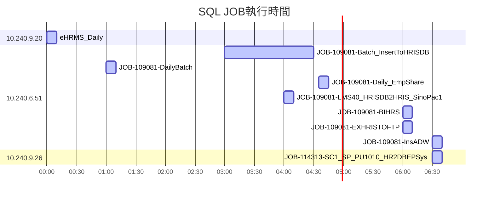

```mermaid
gantt
    dateFormat  HH:mm
    axisFormat %H:%M
    title       SQL JOB執行時間

    section 10.240.9.20
    eHRMS_Daily : active, id1, 00:00, 10m

    section 10.240.6.51
    JOB-109081-Batch_InsertToHRISDB : active,03:00,90m
    JOB-109081-DailyBatch : active,01:00,10m
    JOB-109081-Daily_EmpShare : active,04:35,10m
    JOB-109081-LMS40_HRISDB2HRIS_SinoPac1 : active,04:00,10m
    JOB-109081-BIHRS : active,06:00,10m
    JOB-109081-EXHRISTOFTP : active,06:00,10m
    JOB-109081-InsADW : active,06:30,10m

    section 10.240.9.26
    JOB-114313-SC1_SP_PU1010_HR2DBEPSys : active,06:30,10m
    
```